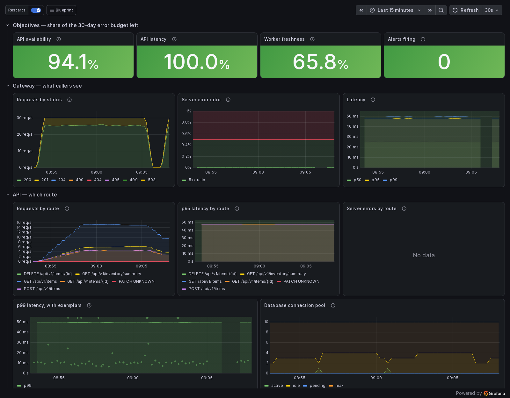
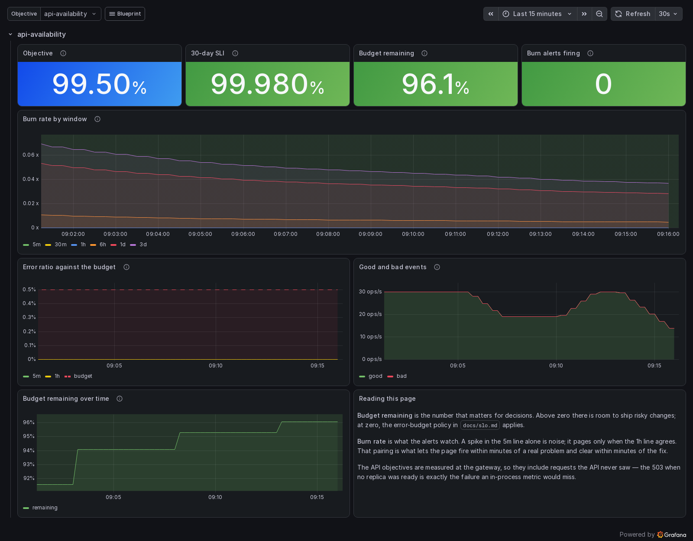

# Production Infrastructure Blueprint

A reference repository that takes a small distributed system from `git push` to a
monitored, alerting, zero-downtime production deployment — and shows what it costs to run.

The point is not that it uses Kubernetes. The point is that every layer is provisioned,
built, deployed, observed, backed up and operated from code in this repository, that the
resulting monthly bill is measured rather than assumed, and that the failure modes which only
appear once services talk to each other are handled rather than hoped away.

**The bill:** one €10.49 ARM node and €6.63 of IP, volume and object storage — **€17.12 a
month** for the application, its database, broker and cache, metrics, logs, traces and backups.
The same architecture on AWS comes to about $168; the managed services and hosted observability a
team would more usually reach for, about $650. `docs/cost-analysis.md` has the arithmetic, the
sources, and what the comparison leaves out.

## Architecture

```
  internet ──▶ Traefik ──▶ api ──┬──▶ Postgres        (system of record) ──▶ WAL + backups ──▶ object storage
                                 ├──▶ Redis           (cache + read model)
                                 └──▶ outbox table
                                          │
                                   outbox relay ──▶ Kafka ──▶ worker ──▶ Redis
                                                                 │
                                                          retry → item-events.DLT
```

A write commits the item and its event in one Postgres transaction. A relay publishes
committed events to Kafka. The worker consumes them idempotently and maintains an inventory
read model in Redis, which the API serves back. Nothing writes to two systems at once, so
there is no state the two services can disagree about permanently.

Four components, held at four. Each exists to demonstrate a specific operational problem:

| Component | The problem it demonstrates |
| --- | --- |
| Traefik | Service discovery that works the same way locally and in Kubernetes |
| api | Schema ownership, cache-aside reads, transactional outbox writes |
| worker | At-least-once delivery, idempotency, bounded retry, dead-letter handling |
| Postgres / Redis / Kafka | Three failure domains with three different health semantics |

`docs/architecture.md` has the diagrams: the write path end to end, what users see when each
component fails, where everything runs, and how a change reaches it.

## Quickstart

Needs Docker or rootless podman with a compose implementation, about 2 GB of free memory, and
ports 8080, 8081, 9090, 9091, 3000, 9093 and 9095. The first build compiles both services inside
the image build and takes a few minutes; later builds reuse the layer cache.

```bash
make bootstrap     # build, start everything, and prove it works
make smoke         # re-run the end-to-end assertions
make down          # stop and delete volumes
```

`make bootstrap` does not return successfully until a request has travelled the whole
system: through the gateway, into Postgres and the outbox, out to Kafka, through the worker
into Redis, and back out of the API's read endpoint.

| | |
| --- | --- |
| API (via gateway) | http://localhost:8080/api/v1/items |
| Inventory summary | http://localhost:8080/api/v1/inventory/summary |
| OpenAPI UI | http://localhost:8080/swagger-ui.html |
| Gateway dashboard | http://localhost:8081/dashboard/ |
| API health / metrics | http://localhost:9090/actuator/health |
| Worker health / metrics | http://localhost:9091/actuator/health |
| Grafana | http://localhost:3000 — dashboards, logs and traces, read-only without a login |
| Prometheus / Alertmanager | http://localhost:9095, http://localhost:9093 |

Run `make help` for every available target, and `make doctor` to see which container
runtime and compose implementation it found. Docker and rootless podman are both supported.

## Stack

| Layer | Technology |
| --- | --- |
| Services | Java 21, Spring Boot 3.5 on virtual threads, Gradle multi-project |
| Gateway | Traefik v3 |
| Persistence | PostgreSQL 16, Spring Data JPA, Flyway (expand/contract, enforced in CI) |
| Cache / read model | Redis 7 |
| Messaging | Apache Kafka 4.x (KRaft, single broker) |
| Backups | Continuous WAL archiving and nightly base backups to object storage; point-in-time restore drilled weekly |
| Container | Multi-stage: layered JAR, `jlink` runtime, distroless non-root |
| Local stack | Docker Compose / podman-compose |
| Orchestration | k3s, Kustomize (base + overlays) |
| Provisioning | Terraform (Hetzner Cloud), Ansible |
| Delivery | GitHub Actions (build, scan, sign) → Flux v2 (reconcile) |
| Admission | Sigstore policy-controller: an image of ours runs only if this repository's CI signed it |
| Certificates | cert-manager + Let's Encrypt (http-01) |
| Secrets | SOPS + age, encrypted in git, decrypted in-cluster |
| Metrics / logs / traces | Prometheus + Alertmanager, Loki + Alloy, Tempo |
| Dashboards | Grafana, provisioned as JSON |

## Delivery pipeline

Four workflows, each with a single required status check so branch protection does not
have to track job names.

| Workflow | Runs on | What it gates |
| --- | --- | --- |
| `ci.yml` | PR, main | Formatting, workflow and shell lint, tests against real Postgres/Redis/Kafka, per-service coverage thresholds, every manifest against the Kubernetes schemas |
| `security.yml` | PR, main, weekly | Secret history, semgrep (community rules plus five written for this repository), hadolint, trivy config, checkov on the rendered manifests, and a weekly re-scan of the *published* images |
| `build.yml` | PR, main, tags | PR: one architecture built, scanned and measured against a size budget. main: amd64 and arm64 built on native runners, joined into one manifest, scanned, then signed with cosign and attested with an SPDX SBOM and SLSA provenance |
| `drills.yml` | PR when relevant, main, weekly | A point-in-time restore from backups that must lose no row and keep none it should not, and a rolling restart of every API pod under load in a real cluster that must fail no request |

Three properties worth knowing about:

- **A change to one service does not rebuild the other.** `platform` is shared, so touching
  it fans back out to both — but a worker-only change never starts the API's test stack.
- **Nothing is signed until it passes, and nothing unsigned runs.** The image is pushed before
  it is scanned, because a multi-arch manifest cannot be assembled otherwise. The gate is the
  signature: an image that fails the scan is never signed, and the cluster's admission webhook
  refuses any image of ours this workflow did not sign — including one validly signed by some
  other workflow.
- **The drills run on a schedule, not only on change.** The base images, the object store's
  API and the node image all move without a commit here.

```bash
make verify-pins                                      # every action pinned to a commit SHA
make verify-image IMAGE=ghcr.io/<owner>/blueprint-api:latest
```

`scripts/verify-image.sh` checks the signature against this repository's workflow identity
specifically — `cosign verify` without `--certificate-identity` passes for anything signed
by any GitHub Actions workflow anywhere, which looks like a control and is not one. See
`docs/adr/0008-supply-chain-pinned-signed-and-attested.md`.

## Observability

Nothing here pages because a number crossed a line. It pages when users are affected, or when
a failure would otherwise be invisible.



- **Three objectives.** Availability and latency are measured at the gateway, which is the only
  place a request that never reached the API is counted. Freshness of the read model is
  measured from the transaction commit, not the Kafka publish. Each has multi-window,
  multi-burn-rate alerts. `docs/slo.md` explains every number.
- **Twenty-one alerts, two severities, each with a promtool unit test** and a section in
  `docs/runbooks/alerts.md`. A test covers when an alert must fire and, just as important,
  when it must not.
- **Signals that link to each other.** A latency exemplar opens a trace. A log line's trace id
  opens the trace. A span opens the logs for the same request.
- **Budgets that fail loudly when exceeded.** Each is enforced in configuration, not written in
  a doc:
  - a series limit per scrape target;
  - a label limit per log stream;
  - histograms that publish only the SLO thresholds;
  - scheduled-task and probe spans dropped before export.

  `docs/cost-analysis.md` has what they saved, and what a hosted vendor would charge for the
  same signals at this system's measured 1,101 log bytes and 1.48 log lines per request.

One set of files serves both environments. Compose mounts them, and the cluster receives them as
ConfigMaps. See `observability/README.md`.

```bash
make obs-validate   # every config through its own binary, alert unit tests, the routing tree
make load           # steady load through the gateway, gated on the SLOs
make drill          # roll every API pod under load in a local kind cluster; fail on one error
make restore-drill  # back up Postgres, destroy it, restore to a second; fail on one wrong row
```

## Deployment

CI never touches the cluster. Its last act is publishing a signed image; Flux, running
inside the cluster, pulls from this repository and reconciles. No kubeconfig and no cloud
credential exists in any workflow.

```
deploy/k8s/     kustomize: base, config, data, migrations, prod and dev overlays, infrastructure
clusters/prod/  what Flux reconciles, and in what order
infra/terraform hcloud: node, network, firewall, volume, object storage, DNS
infra/ansible   node hardening and the k3s bootstrap
```

Reconciliation order is data, not a deploy script:

```
infrastructure-controllers → infrastructure-configs → apps-config → apps-data → apps-migrations → apps
   Traefik, cert-manager,      ACME issuers,        ns, secrets,  Postgres,     Flyway Job     rollout
   policy-controller           image policy         network policy Redis, Kafka
```

Each stage waits for the previous one to be *healthy*, not merely applied. The migration Job
is its own stage so the rollout cannot begin until the schema change has finished — which is
what makes an expand/contract deploy safe rather than optimistic. A semgrep rule fails any
migration that the release still serving could not survive.

Postgres archives every WAL segment to object storage within five minutes and takes a base
backup every night. `docs/runbooks/db-restore.md` restores it to any second in the last fourteen
days, and has been run command by command against these manifests.

Secrets are SOPS-encrypted in git and decrypted by Flux inside the cluster; the age private
key is not in this repository. Image tags are rewritten by Flux's image automation and
committed, so the repository always describes what is actually running.

```bash
make tf-plan          # what terraform would change
make provision-check  # what ansible would change
make k8s-validate     # render every kustomization, check against the real schemas
make k8s-scan         # scan the rendered manifests, as the security workflow does
make flux-status      # what the cluster thinks it is running
```

## What running it found

Every layer here passed its linters and validators before it first ran, and most of the
defects below were invisible to all of them. Each was found by running the thing, and each is
fixed, tested and written up where it was found.

- **The outbox lost events.** A two-minute broker outage used up every pending event's retries
  and stranded them, which contradicted the architecture's central claim. Found by stopping Kafka
  under load; now an outage costs events nothing, and a 150-second one drains 12 seconds after
  the broker returns.
- **The zero-downtime claim was false as shipped.** A pause before SIGTERM does nothing about
  keep-alive connections; 4 of 11,972 requests failed during rollouts, all of them writes. The
  preStop hook now drains connections first: 0 failed of 6,001 in the latest run.
- **A fresh cluster would never have come up.** The migration Job waited for a database that only
  a later stage created, and default-deny network policy blocked both Jobs.
- **An availability SLI computed in the application read 100% through a total outage,** because
  the gateway's own 503s never reach it. The objectives are measured at the gateway.
- **The admission policy the supply chain relied on did not exist,** and once it did, it would
  have refused every image CI publishes: cosign 3 signs in a format the admission controller
  cannot read for image signatures. Found by testing admission, not by reading about it.
- **The restore would have failed at the worst moment.** Postgres rejects a recovery target
  written with `Z` for UTC while it starts. Found by the restore drill, before anyone needed a
  restore.
- **The configuration scanner passed by luck.** checkov's kustomize renderer crashed on this
  tree on some runs and hung on others; it now scans what kustomize renders.

`deploy/k8s/README.md` has the cluster's list in full.

## What to look at first

- **`docs/cost-analysis.md`** — every footprint number in this repository with the method used to
  measure it, and the monthly bill against two AWS builds, line by line. Image size went from
  523 MB to 170 MB; a code-only deploy ships a 33 KB layer.
- **`docs/operations.md`** — what fits on the node, the connection budget, what runs on a
  schedule, and a plain list of what has been exercised and where — including what has not yet
  run against a live Hetzner project.
- **`docs/security.md`** — the controls layer by layer, the admission test results, and the known
  gaps, stated rather than left to be found.
- **`docs/adr/`** — the decisions that were close calls, including the ones that cost
  something. ADR 0004 explains why Kafka was chosen despite being the most expensive line
  in the budget; ADR 0009 why backups need no operator and no derived image.
- **`services/api/src/main/java/dev/tahir/blueprint/outbox/`** — the transactional outbox,
  the reason a broker outage cannot corrupt state or take the API down.
- **`scripts/zero-downtime-drill.sh` and `scripts/restore-drill.sh`** — the zero-downtime and
  point-in-time restore claims, each tested by causing the failure, each run weekly in CI.
- **`docs/slo.md` and `observability/prometheus/tests/`** — three objectives, the reasoning
  behind each number, and unit tests showing when every alert fires and when it stays quiet.
- **`.semgrep/blueprint.yml`** — five rules that encode invariants this system depends on.
  Three of them were defects here before they were rules; the fifth fails a migration that the
  release still serving could not survive.

## Documentation

| | |
| --- | --- |
| `docs/architecture.md` | How the pieces fit, what happens when each fails, where it runs |
| `docs/cost-analysis.md` | Measured footprint, the monthly bill, and the hosting comparison |
| `docs/security.md` | Controls, the threat model they address, and the known gaps |
| `docs/operations.md` | Sizing, capacity, changing things, schedules, what has been run |
| `docs/slo.md` | The objectives, the error budget and its policy |
| `docs/adr/` | Architecture decision records, 0001 to 0010 |
| `docs/runbooks/` | `incident-triage`, `alerts`, `rollback`, `db-restore`, `cert-expiry` and `zero-downtime-migration` — written for whoever is on call |



## License

MIT
