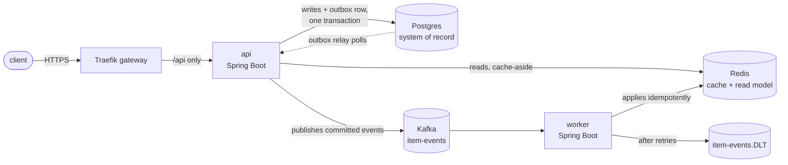
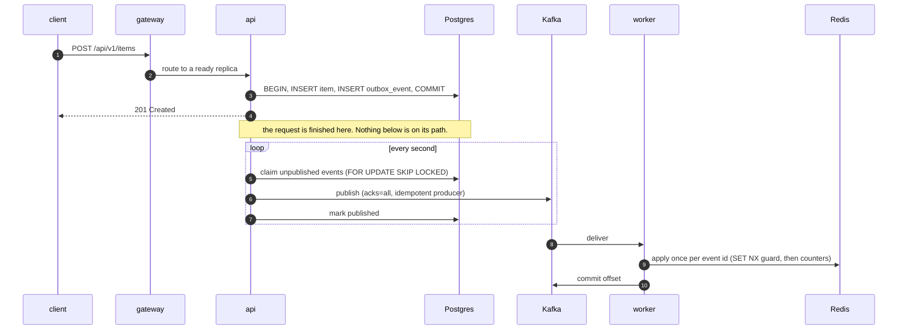
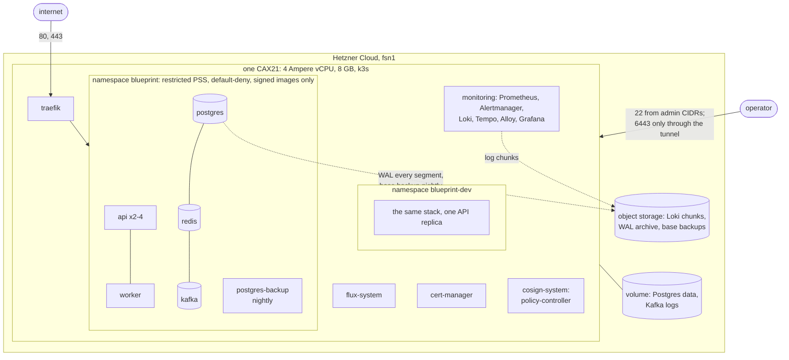
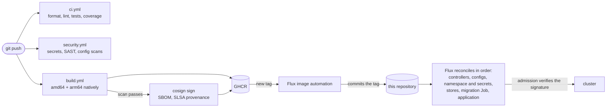

# Architecture

How the pieces fit, what each one is for, and what happens when one of them fails. The decisions
behind the shape are in `docs/adr/`; this document describes the result.

## The system

Four components, held at four. Each exists to demonstrate an operational problem the others do
not have.

| Component | Owns | Demonstrates |
| --- | --- | --- |
| Traefik | routing, TLS, the SLO measurement point | service discovery that works the same way in Compose (labels) and Kubernetes (Ingress) |
| api | the schema, the synchronous path, the outbox and its relay | cache-aside reads, transactional writes, readiness that means something |
| worker | the inventory read model | at-least-once delivery, idempotency, bounded retry, a dead-letter topic |
| Postgres, Redis, Kafka | state | three failure domains with three different consequences |

## A write, end to end

Three properties follow from that shape.

- **No dual write.** The item and the event describing it commit in one transaction. There is no
  moment where Postgres has the write and Kafka does not know, or the reverse. (ADR 0005)
- **A broker outage costs nothing but freshness.** Writes keep committing; the relay stops
  publishing and loses no attempts while the broker is unreachable, and drains the backlog when it
  returns. Readiness does not include Kafka for exactly this reason. (ADR 0007)
- **Delivery is at least once, and that is fine.** A relay crash between publishing and marking an
  event published sends it again; the worker's idempotency guard on the event id makes the second
  delivery a no-op. A record that fails repeatedly goes to the dead-letter topic instead of
  blocking its partition.

The read model can still drift — a Redis restart empties it by design — so the API runs a
reconciler that rewrites it from Postgres. It never corrects while events are in flight, so it
cannot count one twice. (ADR 0006)

## Failure domains

| When this fails | Users see | Because | Detected by |
| --- | --- | --- | --- |
| Postgres | 503 from the gateway | readiness includes the database, so no replica is routable | `ErrorBudgetBurnFast` |
| Redis | correct responses, slower summary reads | reads fall back to Postgres; readiness gates only at startup | `CacheUnavailable` |
| Kafka | correct responses, a stale inventory summary | the outbox absorbs the outage | `OutboxRelayStalled`, freshness SLO |
| worker | correct responses, a stale inventory summary | events wait in Kafka at the committed offset | `WorkerDown` |
| one API replica | nothing | the other replica serves; the gateway stops routing to it | `TargetDown` |
| the gateway | everything fails | it is the only way in | `GatewayDown` |
| the node | everything fails | it is the only node (ADR 0001) | the external dead man's switch |
| the database's data | whatever was destroyed | a migration, a bug, an operator | people; recovery is `docs/runbooks/db-restore.md` |

## Where it runs

Nothing but the gateway is reachable from the internet. The Kubernetes API listens on the private
interface and is reached through SSH; the cloud firewall admits 80, 443 and, from named
addresses only, 22. Inside the cluster every namespace that runs application code starts from
default-deny in both directions (`docs/security.md`).

## How a change reaches it

CI never holds a cluster credential. It publishes a signed image and stops; Flux pulls the change
from git, and the admission webhook refuses any image of ours this workflow did not sign
(ADR 0003, ADR 0008). The ordering between Flux stages is what makes a schema change safe: the
migration Job runs to completion before a single new pod starts
(`docs/runbooks/zero-downtime-migration.md`).

## What observes it

Every service exposes Prometheus metrics on a management port that is never routed from the
internet, logs structured JSON to stdout, and exports traces over OTLP. Alloy ships the logs to
Loki with four stream labels; request and trace ids travel as structured metadata. Grafana joins
the three: a latency exemplar opens its trace, a trace opens its logs.

The API's objectives are measured at the gateway, the only place a request that never reached
the application is counted. Freshness of the read model is measured from the transaction commit,
so relay delay counts against it. (ADR 0010, `docs/slo.md`)

## Locally

`make up` runs the same components in Compose: the gateway discovers the services through
container labels instead of Ingress objects, secrets are files in a gitignored directory instead
of SOPS-decrypted Secrets, and the observability stack is mounted from the same files the cluster
turns into ConfigMaps. What differs is the scheduler, not the system.
